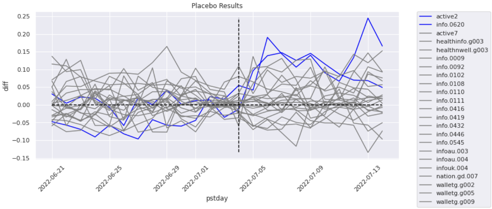

Mystique
=======================

.. contents::

Description
-----------

Mystique is a package for measuring treatment effects on test units using counterfactuals provided
by synthetic controls. There are two main algos, Kirby, for finding control units, and
SyntheticControl, for constructing the counterfactual.

Kirby |kirby|
-------------

Given many possible control units, Kirby selects the closest control units by measuring distance
between the test unit and control unit time series data for the pre intervention period. The
distnace metric used is either the dynamic time warping distance metric, or the euclidean distance
metric. In time series analysis. Dynamic time warping (DTW) is an algorithm for measuring similarity
between two temporal sequences, which may vary in speed. Control units with the smallest distance to
the test unit are selected. By default the top 19 control units are selected for each test unit,
however, this can be specifed as an instance attribute. The same control unit can be selected for
multiple test units.

.. image:: images/dtw.svg
   :width: 500

SyntheticControl
----------------

This algo generates counter factual data for an experiment given the time series data for the test
units and the control units. First we explain the mathematical interpretation, then, what
attributes are required to use the class along with an example.

Formal Math Description
^^^^^^^^^^^^^^^^^^^^^^^
Given $J$ control units, $K$ test units, and $m$ features, the
SyntheticControl algo minimizes the following for each test unit $i \\in \\{1, ... ,K\\}$

$$||X_i - X_0 W_i||_V + \\lambda_i \\sum_{j = 1}^{J} w_j ||X_i - X_j||$$

Where
$$W_i = (w_1, ... , w_J)$$
$$w_1, ... , w_J \\geq 0$$
$$w_1 + \\cdots + w_J = 1$$
$$\\lambda_i \\geq 0$$

The first term in the expression to be minimized is the aggregate discrepancy between the predictor
values for treated unit $i$ and its synthetic control. The second term penalizes pairwise matching
discrepancies between the predictor values for unit $i$ and each of the units that contribute to its
synthetic control, weighted by the magnitudes of their contributions.

The norm $||\\cdot||_V$ is the norm induced by the diagonal matrix $V$ where the diagonal of $V$ is
made up of $m$ weights which approximate the predictive power of the features used in $X_i$ and
$X_0$. $X_i$ is the feature vector for test unit $i$ of length $m$. $X_0$ is a $J \\times m$ matrix
of features with $J$ control units and $m$ features. $X_j$ is the feature vector for the jth control
unit from $X_0$.  $\\lambda_i$ is the weight of the penalty term for test unit $i$.

The hyper parameters $V$ and $\\lambda$ are trained using either prospective or retrospective
modeling.To train $\\lambda$ prospectively, the pre intervention time series data for the test unit
is split into a training set and validation set, and the MSPE is minimized on the validation set. To
train $\\lambda$ retrospectively we use leave-one-out cross-validation of post intervention
outcomes for the control units. For a given $\\lambda$, synthetic controls are calculated for each
control unit and the aggregate error for the post intervention period is minimized. This error is
measured as the sum of the squared prediction errors for each time period for each control unit. The
motivation for training lambda was taken from Abadie and L'Hour's paper "A penalized Synthetic
Control Estimator for Disaggregated Data."
`(Abadie & L'Hour 2019) <https://file.lianxh.cn/PDFTW/01621459.2021.pdf>`_

As $\\lambda$ ranges from $0$ to $\\inf$, the resulting synthetic control will go from closest match
in aggregate, to nearest neighbor match. i.e. As we increase $\\lambda$ we will eventually get a
synthetic control weighting of $(0, 0, 1, 0, ... , 0)$ where the $1$ is in the position of the
nearest neighbor. The retrospective and prospective models select lambda in a way that minimizes
prediction error.

Factor weights $V$ used in the induced norm $||\\cdot||_V$ above are determined by solving a
separate problem using sklearn's MultiTaskLasso multiple regression model. The factor weights $V$
minimize the expression

$$\\frac{1}{2J} ||Y - XV||^2_{Fro} + \\alpha ||V||_{21}$$
$$||V||_21 = \sum_i \sqrt{\sum_j v_{ij}^2}$$

Where $X$ is a $J \\times m$ matrix of features with $J$ control units and $m$ features, the same as
$X_0$ from earlier. $Y$ is time series data for the control units from either the pre or post
intervention period depending on the model type. If the model type is prospective, then the pre
intervention data for the test unit is split into a training and validation set from which we take
$X$ and $Y$ respeectively. If the model type is retrospective, then $X$ and $Y$ are constructed from
pre and post intervention data respectively.

Required & Optional Arguments
^^^^^^^^^^^^^^^^^^^^^^^^^^^^^
A new instance of the SyntheticConrol object requires at minimum the following arguments:

+--------------------+------------------+----------------------------------------------------+----------------------------------+
| param              | type             | description                                        | example                          |
+====================+==================+====================================================+==================================+
| ``data``           | ``pd.DataFrame`` | Time series data for the outcome metric            | ``pd.read_csv('data.txt')``      |
|                    |                  | for both the test units and control units along    |                                  |
|                    |                  | with any features to be included in the synthetic  |                                  |
|                    |                  | control algo.                                      |                                  |
+--------------------+------------------+----------------------------------------------------+----------------------------------+
| ``test_units``     | ``list[str]``    | List of test units that are found in               | ``['campaign_1', 'campaign_2']`` |
|                    |                  | the column containing test units and control units |                                  |
|                    |                  | inthe 'data' data frame.                           |                                  |
+--------------------+------------------+----------------------------------------------------+----------------------------------+
| ``units_col``      | ``str``          | The column name that the test and                  | ``'campaign_id'``                |
|                    |                  | control units are in in the 'data' data frame.     |                                  |
+--------------------+------------------+----------------------------------------------------+----------------------------------+
| ``outcome_metric`` | ``str``          | The metric for which we are                        | ``'profit'``                     |
|                    |                  | constructing the counter factual for. This should  |                                  |
|                    |                  | correspond to its column name in the 'data' data   |                                  |
|                    |                  | frame.                                             |                                  |
+--------------------+------------------+----------------------------------------------------+----------------------------------+
| ``date_col``       | ``str``          | The name of the column containing the              | ``'data`_date'``                 |
|                    |                  | date in the 'data' data frame.                     |                                  |
+--------------------+------------------+----------------------------------------------------+----------------------------------+

With optional arguments:

+----------------------------+---------------+--------------------------------------------------------+---------------------------------------------+
| param                      | type          | description                                            | example                                     |
+============================+===============+========================================================+=============================================+
| ``event_date``             | ``str``       | Defaults to None. If no event date is                  | ``'2022-11-25'``                            |
|                            |               | provided, all the data will be considered pre          |                                             |
|                            |               | intervention data and the event_date will be           |                                             |
|                            |               | set to the max date. Must be of the form 'YYYY-MM-DD'. |                                             |
+----------------------------+---------------+--------------------------------------------------------+---------------------------------------------+
| ``covariates``             | ``list[str]`` | List of column names in 'data'                         | ``['revenue', 'rpc', 'margin_pct']``        |
|                            |               | that should be added as additoinal features for        |                                             |
|                            |               | the synthetic control algo.                            |                                             |
+----------------------------+---------------+--------------------------------------------------------+---------------------------------------------+
| ``model_type``             | ``str``       | Either 'prospective' or 'retrospective'.               | ``'retrospective'``                         |
|                            |               | Defaults to 'prospective'.                             |                                             |
+----------------------------+---------------+--------------------------------------------------------+---------------------------------------------+
| ``norm_type``              | ``str``       | Either 'standard' or 'induced'.                        | ``'standard'``                              |
|                            |               | Defaults to 'induced'.                                 |                                             |
+----------------------------+---------------+--------------------------------------------------------+---------------------------------------------+
| ``lam``                    | ``float``     | Short for lambda. Defaults to None.                    | ``0.0261``                                  |
|                            |               | It is reccomneded that this is left as None so         |                                             |
|                            |               | that an optimal lambda can be trained. If a            |                                             |
|                            |               | value for lam is provided, no training will be         |                                             |
|                            |               | performed on lambda.                                   |                                             |
+----------------------------+---------------+--------------------------------------------------------+---------------------------------------------+
| ``training_periods``       | ``int``       | The number of training periods to                      | ``14``                                      |
|                            |               | use for the prospective model.                         |                                             |
+----------------------------+---------------+--------------------------------------------------------+---------------------------------------------+
| ``aggregate_function_map`` | ``dict``      | A mapping for values that reuire a formula             | .. code:: python                            |
|                            |               | upong aggreation over a specific window.               |                                             |
|                            |               |                                                        |     {                                       |
|                            |               |                                                        |         'rpc': lambda row:                  |
|                            |               |                                                        |             row['revenue'] / row['clicks'], |
|                            |               |                                                        |         'margin_pct': lambda row:           |
|                            |               |                                                        |             (row['revenue'] - row['spend']) |
|                            |               |                                                        |             / row['revenue']                |
|                            |               |                                                        |     }                                       |
+----------------------------+---------------+--------------------------------------------------------+---------------------------------------------+

Treatment Effects
-----------------

The estimated treatment effects due to the intervention are calculated as the difference between the
test unit outcomes and its corresponding synthetic control over the post intervention period. In the
plot below, this is the difference between the active2 plot and the synthetic_active2 plot after the
vertical dotted line marking the event date.

The difference between these two lines is plotted below. We can see in this example the treatment
effect gets close to a $0.15 increase in rpc on some days.

RMSPE Ratios
^^^^^^^^^^^^

To assess the significance of the estimated treatment effects, we run placebo tests by applying
the synthetic control algo to each of the control units. Then compare the estimated treatment
effect on the control units to the estimated treatment effect on the test units. This is shown in
the plot below which shows the difference between the synthetic control and its corresponding unit,
with test units highlighted in blue.

One way to evaluate the estimated treatment effect relative to the effect obtained from the placebo
tests is to consider the ratio of the RMSPE of the synthetic control for the pre and post
intervention periods (RMSPE ratio).

$$r_i = \\frac{\\text{post rmspe}}{\\text{pre rmspe}} $$

A large RMSPE in the post intervention period may indicate a large treatment effect, however, if the
synthetic control is a poor fit, then the pre intervention RMSPE will also be large, and the
corresponding RMSPE ratio will not be large in magnitude. If the synthetic control is a good fit,
then the pre intervention RMSPE will be small and the RMSPE ratio will be large. If the RMSPE ratio
for a given test unit is substantially larger than the RMSPE ratio for the control units, then we
can reject the null hypothesis. Moreover, we can calculate the probability of observing such a large
RMSPE ratio as a p-value. The plot below shows the distribution of RMSPE ratios for both test units
and control units.

We can see the RMSPE ratio for one of the test units (active2) is substantially larger than the
control units and the other test unit. The probability of an RMSPE ratio this large is 1 / 20 or
0.05. That is, if one were to assign the intervention at random in the data, the probability of
obtaining an RMSPE ratio as large as the test unit active2 is 0.05, giving us a p-value of 0.05. The
only unclear part in this process is describing this ratio as "substantially" larger than the
control units. We formally describe a test unit RMSPE ratio as substantially larger than the control
unit RMSPE ratios if the following two conditions are true.

Separate: The test unit RMPSE ratio is greater than all the control unit RMSPE ratios.

Far: The test unit RMSPE ratio is at least 3 standard deviations larger than the mean of the control
unit RMSPE ratios.
 
If a test unit RMSPE ratio is both separate and far then we can reject the null hypothesis. In this
scenario the separate and far test is preferred over the p-value since the p-value partially
depends on how many control units exist, of which some could be added or taken away.

Examples
--------

Below is an example on how to use the Kirby and SyntheticControl algos.

.. code:: python

    import pandas as pd
    from s1_mystique import Kirby, SyntheticControl

    df_campaigns = pd.read_csv("domestic_taboola_campaigns.csv")

    # Create an instance of Kirby
    kb = Kirby(
        data=df_campaigns,
        test_units=["campaign_t1", "campaign_t2"],
        units_col="campaign_id",
        outcome_metric="profit",
        date_col="data_date"
        event_date="2022-11-25",
    )

    # Run get_control_units method to get the best control units for the experiment. This method
    # returns the original data frame df_campaigns subset to campaigns selected by Kirby.
    exp_data = kb.get_control_units()

    # Create an instance of SyntheticControl
    sc = SyntheticControl(
        data=exp_data,
        test_units=["campaign_t1", "campaign_t2"],
        units_col="campaign_id",
        outcome_metric="profit",
        date_col="data_date",
        event_date="2022-11-25",
        covariates=["rpc", "spend"],
        model_type="retrospective",
        aggregate_function_map={
            "rpc": lambda row: row["revenue"] / row["clicks"]
        }
    )

    # Run the find_weights and fit_synthetic_control methods to construct the counter factuals for
    # the test units
    sc.find_weights()
    sc.fit_synthetic_control()

    # Approximate the treatment effects in aggregate with estimate_effects.
    diff, mean_effects, mean_effects_agg = sc.estimate_effects()

    # Run the placebo test to determine significance of the estimated treatment effects.
    sc.run_placebo_test()

Tests
-----

Note: these Make targets can be invoked with `USE_TOX_IMAGE=true` should you decide
not to setup tox.

Lint code with

::

    $ make lint

Check cyclomatic code complexity with

::

    $ make complexity

Run tests with

::

    $ make test

Install
-------

Install without running linter, cyclomatic complexity and unit tests:

::

    $ make install

Run linter and unit tests:

::

    $ make
